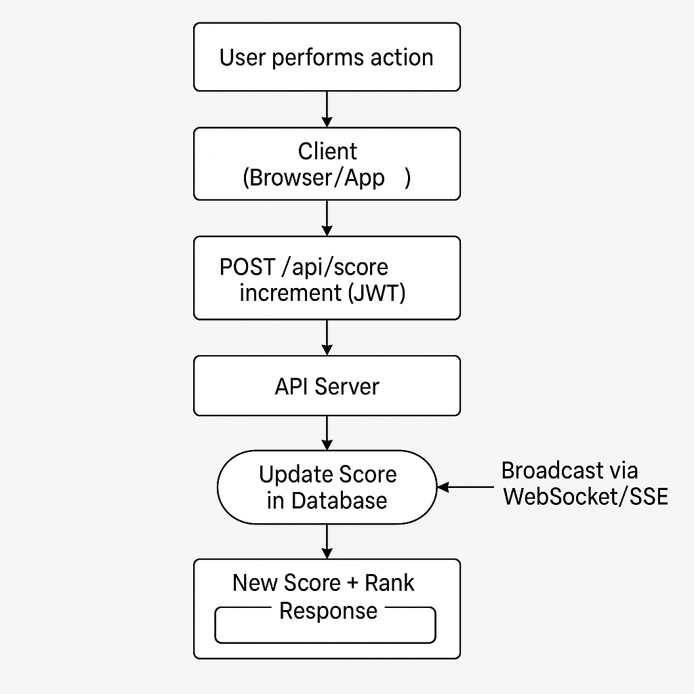
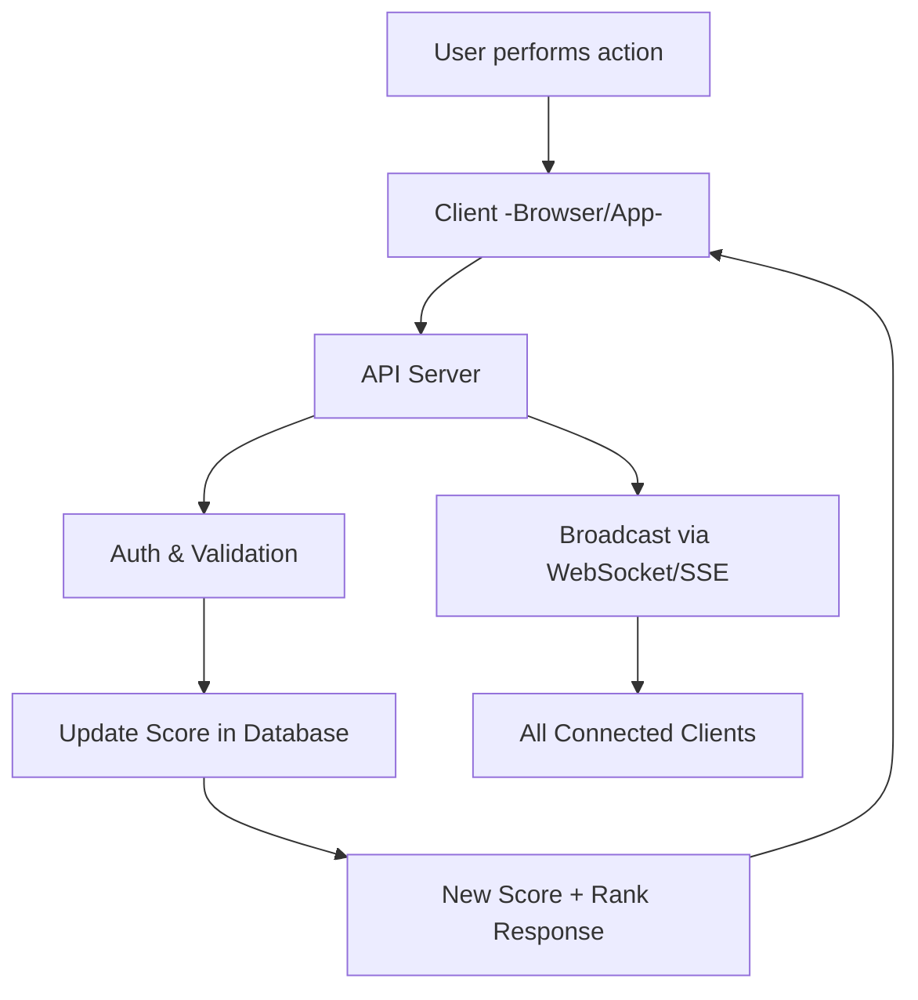

# Scoreboard API Specification

## Overview
This module provides a backend service for maintaining and displaying a **live-updating scoreboard** that shows the **top 10 user scores**.

Key requirements:
- Real-time scoreboard updates (WebSockets or Server-Sent Events).
- Secure score updates only from authorized users.
- Efficient queries to always return the top 10 users.

---

## Functional Requirements

1. **Scoreboard Display**
    - Fetch top 10 users and their scores.
    - Provide live updates to connected clients.

2. **Score Update**
    - Secure endpoint to increment user score after action completion.
    - Validate via authentication & authorization.
    - Server controls increment value (not the client).

3. **Authentication**
    - Require JWT/session/OAuth token for score updates.
    - Prevent replay attacks and request spamming.

4. **Persistence**
    - Store scores in a database (PostgreSQL, MySQL, MongoDB).
    - Query top 10 efficiently with indexes or caching.

---

## API Endpoints

### 1. GET /api/scoreboard
**Description:** Returns top 10 users by score.  
**Auth:** Public.

**Response (200):**
```json
{
  "scores": [
    { "userId": "u1", "username": "Alice", "score": 1250 },
    { "userId": "u2", "username": "Bob", "score": 1190 }
  ],
  "timestamp": "2025-09-20T10:15:00Z"
}
```

---

### 2. POST /api/score/increment
**Description:** Increment authenticated user’s score.  
**Auth:** Required (JWT/session).

**Request:**
```http
POST /api/score/increment
Authorization: Bearer <token>
```

**Response (200):**
```json
{
  "userId": "u1",
  "newScore": 1251,
  "rank": 5
}
```

**Errors:**
- 401 Unauthorized
- 403 Forbidden
- 429 Too Many Requests

---

### 3. Live Updates
**WebSocket or SSE Channel:** `/ws/scoreboard`

**Broadcast Example:**
```json
{
  "event": "score_updated",
  "userId": "u1",
  "newScore": 1251,
  "top10": [
    { "userId": "u1", "username": "Alice", "score": 1251 }
  ]
}
```

---

## Execution Flow Diagram



<details>
<summary>Mermaid fallback (in case image doesn’t render)</summary>



</details>
---

## Security Considerations
- **Server-side increment logic** (not controlled by client).
- **JWT/OAuth authentication** required.
- **Replay protection** with nonces or timestamp validation.
- **Rate limiting** for abuse prevention.
- **Audit logs** to track suspicious activity.

---

## Suggested Improvements
1. Add **Redis caching** for fast top 10 lookups.
2. Use **WebSocket gateway** for scalability.
3. Support **periodic leaderboard resets** (daily/weekly/monthly).
4. Add **cheat detection analytics**.
5. Plan for **sharding/partitioning** if user base is very large.

---
